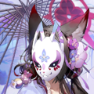

# Character Ranking List of Bluearchive [Safe]

## Overall Ranking

Bluearchive game character safe picture number ranking on pixiv, the top 40 characters. 

|   Rank | Face                                                                                                                                                                                                                                                                                                                                                                                                                                                                                                                                                                                                                                                                                                                                                                                                                                                       | CN   | JP     | EN      |   All Images |   R18 Images |
|--------|------------------------------------------------------------------------------------------------------------------------------------------------------------------------------------------------------------------------------------------------------------------------------------------------------------------------------------------------------------------------------------------------------------------------------------------------------------------------------------------------------------------------------------------------------------------------------------------------------------------------------------------------------------------------------------------------------------------------------------------------------------------------------------------------------------------------------------------------------------|------|--------|---------|--------------|--------------|
|      1 | %20-asuna_ichinose%20-asunaichinose%20-ichinoseasuna%20-%E4%B8%80%E4%B9%8B%E6%BF%91%E6%98%8E%E6%97%A5%E5%A5%88%20-%E4%B8%80%E4%B9%8B%E7%80%A8%E6%98%8E%E6%97%A5%E5%A5%88/artworks?order=popular_d&s_mode=s_tag&mode=all)                                                                                                                                                                                                                                                                                          | 明日奈  | 一之瀬アスナ | asuna   |        12289 |         4526 |
|      2 | %20-hayaseyuuka%20-%E6%97%A9%E6%BF%91%E4%BC%98%E9%A6%99%20-%E6%97%A9%E7%80%AC%E4%BC%98%E9%A6%99%20-%E8%BF%90%E5%8A%A8%E6%9C%8D%E4%BC%98%E9%A6%99/artworks?order=popular_d&s_mode=s_tag&mode=all)                                                                                                                                                                                                                                                                                                                                               | 优香   | 早瀬ユウカ  | yuuka   |         9095 |         2244 |
|      3 | %20-sunaookami_shiroko%20-sunaookamishiroko%20-%E3%83%86%E3%83%A9%E3%83%BCshirokotera%20-%E7%99%BD%E5%AD%90%E9%A7%85%20-%E7%A0%82%E7%8B%BC%E7%99%BD%E5%AD%90%20-%E9%BB%91%E7%99%BD%E5%AD%90/artworks?order=popular_d&s_mode=s_tag&mode=all)                                                                                                                                                                                                                                                                                                                                              | 白子   | 砂狼シロコ  | shiroko |         8277 |         1707 |
|      4 | %20-tendouarisu/artworks?order=popular_d&s_mode=s_tag&mode=all)                                                                                                                                                                                                                                                                                                                                                                                                                                                                       | 爱丽丝  | 天童アリス  | arisu   |         6598 |         1214 |
|      5 | %20-moona_hoshinova%20-takanashihoshino%20-%E5%B0%8F%E9%B3%A5%E9%81%8A%E3%81%9F%E3%81%8B%E3%81%AA%E3%81%97%E3%83%9B%E3%82%B7%E3%83%8E%20-%E5%B0%8F%E9%B3%A5%E9%81%8A%E6%98%9F%E9%87%8E%20-%E5%B0%8F%E9%B8%9F%E6%B8%B8%E6%98%9F%E9%87%8E%20-%E6%98%9F%E9%87%8E%E3%82%A2%E3%82%A4/artworks?order=popular_d&s_mode=s_tag&mode=all)                                                                                                                                                                          | 星野   | 小鳥遊ホシノ | hoshino |         6213 |         1158 |
|      6 | %20-chinatsu%20-hinasorasaki%20-hinata%20-shirosakihina%20-sorasakihina%20-%E4%B8%80%E4%B9%8B%E7%80%AC%E6%98%8E%E6%97%A5%E5%A5%88%20-%E6%98%8E%E6%97%A5%E5%A5%88%20-%E7%A9%BA%E5%B4%8E%E9%98%B3%E5%A5%88%20-%E7%A9%BA%E7%90%A6%E6%97%A5%E5%A5%88/artworks?order=popular_d&s_mode=s_tag&mode=all)                                                                                                                                                                                                                                         | 日奈   | 空崎ヒナ   | hina    |         6150 |         1435 |
|      7 | %20-aru%E5%AD%90%20-bigsaru%20-deltarune%20-gyaru%20-haruka%20-haruna%20-koharu%20-naruto%20-naruto1000users%E5%85%A5%E3%82%8A%20-rikuhachimaaru/artworks?order=popular_d&s_mode=s_tag&mode=all)                                                                                                                                                                                                                                                                                                                                                                                                       | 阿露   | 陸八魔アル  | aru     |         5808 |         1042 |
|      8 | %20-kakudatekarin%20-karinkakudate%20-%E8%A7%92%E6%A5%AF%E8%8A%B1%E5%87%9B/artworks?order=popular_d&s_mode=s_tag&mode=all)                                                                                                                                                                                                                                                                                                                                                                                                                                                                        | 花凛   | 角楯カリン  | karin   |         5792 |         1936 |
|      9 | %20-kuwakamikaho%20-mikamiruka%20-mikamoneru%20-misonomika/artworks?order=popular_d&s_mode=s_tag&mode=all)                                                                                                                                                                                                                                                                                                                                                                                                                                                                                                                                 | 未花   | 聖園ミカ   | mika    |         5260 |          734 |
|     10 | %20-asumatoki%20-%E6%97%B6%E9%9B%A8%20-%E9%87%8E%E4%BA%BA%E6%97%B6%E4%BB%A3%20-%E9%A3%9E%E9%B8%9F%E9%A9%AC%E6%97%B6/artworks?order=popular_d&s_mode=s_tag&mode=all)                                                                                                                                                                                                                                                                                                                                                                                                                                               | 时    | 飛鳥馬トキ  | toki    |         4858 |         1015 |
|     11 | %20-shimoekoharu%20-%E5%B0%8F%E6%98%A5%E5%85%AD%E8%8A%B1/artworks?order=popular_d&s_mode=s_tag&mode=all)                                                                                                                                                                                                                                                                                                                                                                                                                                            | 小春   | 下江コハル  | koharu  |         4709 |         1241 |
|     12 | %20-himari%20-kitagawamarin%20-maria%20-marina%20-mario_madness%20-marisa%20-supermario%20-%E4%BC%8A%E8%90%BD%E3%83%9E%E3%83%AA%E3%83%BCmari%20-%E4%BC%8A%E8%90%BD%E7%8E%9B%E4%B8%BD%20-%E4%BE%9D%E8%90%BD%E7%8E%9B%E4%B8%BD%20-%E7%8E%9B%E4%B8%BD%E5%AE%89/artworks?order=popular_d&s_mode=s_tag&mode=all)                                                                                                                                                                                                                                                                    | 玛丽   | 伊落マリー  | mari    |         3903 |         1152 |
|     13 | %20-ajitanihifumi%20-hifumi_ajitani%20-hifumidaisuki%20-%E9%98%BF%E6%85%88%E8%B0%B7%E6%97%A5%E5%AF%8C%E7%BE%8E/artworks?order=popular_d&s_mode=s_tag&mode=all)                                                                                                                                                                                                                                                                                                                                                                                                               | 日富美  | 阿慈谷ヒフミ | hifumi  |         3719 |          628 |
|     14 | %20-asagimutsuki%20-%E3%83%A0%E3%83%84%E3%82%AD%E7%9D%A6%E6%9C%88%20-%E6%B5%85%E9%BB%84%E7%9D%A6%E6%9C%88%20-%E7%9D%A6%E6%9C%88%E9%A1%94/artworks?order=popular_d&s_mode=s_tag&mode=all)                                                                                                                                                                                                                                                                                                                                                                                                     | 睦月   | 浅黄ムツキ  | mutsuki |         3682 |         1112 |
|     15 | %20-hanekawahasumi%20-hasumihanekawa%20-%E7%BE%BD%E5%B7%9D%E8%8E%B2%E8%A7%81/artworks?order=popular_d&s_mode=s_tag&mode=all)                                                                                                                                                                                                                                                                                                                                                                                                                                        | 莲见   | 羽川ハスミ  | hasumi  |         3568 |         1379 |
|     16 | %20-kayokobluearchive%20-onikatakayoko%20-%E9%AC%BC%E6%96%B9%E4%BD%B3%E4%BB%A3%E5%AD%90/artworks?order=popular_d&s_mode=s_tag&mode=all)                                                                                                                                                                                                                                                                                                                                                                                          | 佳代子  | 鬼方カヨコ  | kayoko  |         3509 |          467 |
|     17 | %20-akoamau%20-amauako%20-blue_archive_ako%20-hakosbaelz%20-hanako%20-hyakkiyako%20-hyakkiyakou%20-miyako%20-sakurako%20-shirobako%20-sunoharakokona%20-urawa_hanako%20-%E5%A4%A9%E9%9B%A8%E4%BA%9A%E5%AD%90/artworks?order=popular_d&s_mode=s_tag&mode=all)                                                                                                                                                                                                                                                                                                                                                           | 亚子   | 天雨アコ   | ako     |         2938 |         1192 |
|     18 | %20-mikamoneru%20-%E7%BE%8E%E7%94%98%E5%B0%BC%E7%A6%84/artworks?order=popular_d&s_mode=s_tag&mode=all)                                                                                                                                                                                                                                                                                                                                                                                                                                                       | 尼禄   | 美甘ネル   | neru    |         2835 |          642 |
|     19 | %20-kizunaai%20-kudaizuna/artworks?order=popular_d&s_mode=s_tag&mode=all)                                                                                                                                                                                                                                                                                                                                                                                                                                              | 泉奈   | 久田イズナ  | izuna   |         2774 |          519 |
|     20 | %20-saibamomoi%20-%E6%A1%83%E4%BA%95%E6%84%9B%E8%8E%89/artworks?order=popular_d&s_mode=s_tag&mode=all)                                                                                                                                                                                                                                                                                                                                                                                                                                                   | 桃井   | 才羽モモイ  | momoi   |         2770 |          520 |
|     21 | %20-saibamidori%20-%E5%B0%8F%E7%BB%BF%20-%E6%89%8D%E7%BE%BD%E7%BB%BF/artworks?order=popular_d&s_mode=s_tag&mode=all)                                                                                                                                                                                                                                                                                                                                                                                                                                                                                      | 绿    | 才羽ミドリ  | midori  |         2743 |          562 |
|     22 | %20-izayoinonomi/artworks?order=popular_d&s_mode=s_tag&mode=all)                                                                                                                                                                                                                                                                                                                                                                                                                               | 野宫   | 十六夜ノノミ | nonomi  |         2681 |          794 |
|     23 | %20-azusashirasu%20-kazusa%20-shirasuazusa%20-%E4%B8%AD%E9%87%8E%E6%A2%93%20-%E6%B3%B3%E8%A3%85%E6%A2%93%20-%E7%99%BD%E5%B7%9E%E6%A2%93/artworks?order=popular_d&s_mode=s_tag&mode=all)                                                                                                                                                                                                                                                                                                                                                                                  | 梓    | 白洲アズサ  | azusa   |         2665 |          348 |
|     24 | %20-kasumizawamiyu%20-miyukasumizawa%20-%E6%9C%94%E6%9C%88%E7%BE%8E%E6%B8%B8%20-%E9%9C%9E%E6%B2%A2%E7%BE%8E%E6%B8%B8/artworks?order=popular_d&s_mode=s_tag&mode=all)                                                                                                                                                                                                                                                                                                                                                                   | 美游   | 霞沢ミユ   | miyu    |         2616 |          635 |
|     25 | %20-nekodukahibiki%20-nekozukahibiki/artworks?order=popular_d&s_mode=s_tag&mode=all)                                                                                                                                                                                                                                                                                                                                                                                                                                            | 响    | 猫塚ヒビキ  | hibiki  |         2555 |          472 |
|     26 | %20-shiromiiori%20-%E4%BC%8A%E7%BB%87%E4%BD%90%E4%BB%93%20-%E9%8A%80%E9%8F%A1%E4%BC%8A%E7%BB%87/artworks?order=popular_d&s_mode=s_tag&mode=all)                                                                                                                                                                                                                                                                                                                                                                                                            | 伊织   | 銀鏡イオリ  | iori    |         2489 |          619 |
|     27 | %20-%E5%8F%A4%E5%85%B3%E5%BF%A7%20-%E8%B0%B7%E5%85%B3%E5%BF%A7/artworks?order=popular_d&s_mode=s_tag&mode=all)                                                                                                                                                                                                                                                                                                                                                                                                                                                                                                                              | 忧    | 古関ウイ   | ui      |         2392 |          554 |
|     28 | %20-dailynoa%20-noai%20-ushionoa%20-%E7%94%9F%E5%A1%A9%E8%AF%BA%E4%BA%9A%20-%E7%94%9F%E7%9B%90%E8%AF%BA%E4%BA%9A/artworks?order=popular_d&s_mode=s_tag&mode=all)                                                                                                                                                                                                                                                                                                                                                                                                                            | 诺亚   | 生塩ノア   | noa     |         2201 |          532 |
|     29 | %20-bluearchiveiroha%20-natsumeiroha/artworks?order=popular_d&s_mode=s_tag&mode=all)                                                                                                                                                                                                                                                                                                                                                                                                                                                                   | 伊吕波  | 棗イロハ   | iroha   |         2162 |          466 |
|     30 | %20-jomaesaori%20-joumaesaori%20-saorijoumae/artworks?order=popular_d&s_mode=s_tag&mode=all)                                                                                                                                                                                                                                                                                                                                                                                                                                                                                                                                   | 纱织   | 錠前サオリ  | saori   |         2099 |          391 |
|     31 | %20-kyouyama_kazusa%20-kyoyamakazusa%20-%E6%9D%8F%E5%B1%B1%E5%92%8C%E7%BA%B1/artworks?order=popular_d&s_mode=s_tag&mode=all)                                                                                                                                                                                                                                                                                                                                                                                                                                                                   | 和纱   | 杏山カズサ  | kazusa  |         2087 |          391 |
|     32 | %20-sunoharashun%20-%E7%9B%AE%E3%81%8C%E9%80%A2%E3%81%86%E7%9E%AC%E9%96%93%20-%E7%9E%AC%E3%81%8D%20-%E7%9E%AC%E7%8D%84%E6%AE%BA/artworks?order=popular_d&s_mode=s_tag&mode=all)                                                                                                                                                                                                                                                                                                                                                                            | 瞬    | 春原シュン  | shun    |         2039 |          811 |
|     33 | %20-hanaokayuzu%20-yuzu_hanaoka%20-yuzutalk%20-%E5%B0%8F%E5%B1%B1%E6%9F%9A%E5%AD%90%20-%E8%8A%B1%E5%86%88%E6%9F%9A%E5%AD%90%20-%E8%8A%B1%E5%B2%97%E6%9F%9A%E5%AD%90%20-%E8%8A%B1%E5%B2%A1%E6%9F%9A%E5%AD%90/artworks?order=popular_d&s_mode=s_tag&mode=all)                                                                                                                                                                                                                                                                                                                                                     | 柚子   | 花岡ユズ   | yuzu    |         2000 |          393 |
|     34 | %20-urawahanako%20-uruwahanako/artworks?order=popular_d&s_mode=s_tag&mode=all)                                                                                                                                                                                                                                                                                                                                                                                                                                                                                                                                             | 花子   | 浦和ハナコ  | hanako  |         1705 |          634 |
|     35 | %20-igusaharuka/artworks?order=popular_d&s_mode=s_tag&mode=all)                                                                                                                                                                                                                                                                                                                                                                                                                                                                                                                                  | 遥香   | 伊草ハルカ  | haruka  |         1648 |          233 |
|     36 | %20-kuromiserika%20-%E9%BB%91%E8%A7%81%E8%8A%B9%E9%A6%99%20-%E9%BB%92%E8%A6%8B%E3%81%8F%E3%82%8D%E3%81%BF%E3%82%BB%E3%83%AA%E3%82%AB/artworks?order=popular_d&s_mode=s_tag&mode=all)                                                                                                                                                                                                                                                                                                                                              | 芹香   | 黒見セリカ  | serika  |         1647 |          271 |
|     37 | %20-kasugatsubaki%20-kasukatsubaki%20-%E6%98%A5%E6%97%A5%E6%A4%BF%20-%E6%A4%BF%E4%B8%89%E5%8D%81%E9%83%8E%20-%E7%9B%B8%E5%8E%9F%E6%A4%BF%20-%E8%97%8D%E5%8E%9F%E6%A4%BF%20-%E9%9F%B3%E5%A4%A2%E6%A4%BF/artworks?order=popular_d&s_mode=s_tag&mode=all)                                                                                                                                                                                                                                                                                                                                               | 椿    | 春日ツバキ  | tsubaki |         1626 |          611 |
|     38 | %20-%E6%98%A5%E5%8E%9F%E5%BF%83%E5%A5%88/artworks?order=popular_d&s_mode=s_tag&mode=all)                                                                                                                                                                                                                                                                                                                                                                                                     | 心奈   | 春原ココナ  | kokona  |         1562 |          521 |
|     39 | %20-chinatsu%20-natsu_yutori%20-natsuki%20-natsumeiroha%20-%E4%B9%BE%E5%A4%8F%E5%AF%A7%20-%E4%BC%8A%E5%9C%B0%E7%9F%A5%E8%99%B9%E5%A4%8F%20-%E5%A4%8F%E4%BC%91%E3%81%BF%20-%E5%A4%8F%E5%90%89%E3%82%86%E3%81%86%E3%81%93%20-%E5%A4%8F%E6%9C%8D%20-%E5%A4%8F%E7%A5%AD%E3%82%8A%20-%E5%A4%8F%E7%A9%BA%20-%E5%A4%8F%E7%A9%BA%E3%81%AE%E3%82%A6%E3%82%A3%E3%83%83%E3%82%B7%E3%83%A5%E3%83%AA%E3%82%B9%E3%83%88%20-%E6%9F%9A%E9%B8%9F%E5%A4%8F%20-%E7%9C%9F%E5%A4%8F%E3%81%AE%E5%A4%9C%E3%81%AE%E6%B7%AB%E5%A4%A2%20-%E9%99%BD%E5%A4%8F%E6%9C%A8%E3%83%9F%E3%82%AB%E3%83%B3/artworks?order=popular_d&s_mode=s_tag&mode=all) | 夏    | 柚鳥ナツ   | natsu   |         1513 |          282 |
|     40 | %20-kosakawakamo%20-%E7%8B%90%E5%9D%82%E8%8B%A5%E8%97%BB%20-%E8%8B%A5%E8%97%BB%E6%B3%B3%E8%A3%85/artworks?order=popular_d&s_mode=s_tag&mode=all)                                                                                                                                                                                                                                                                                                                                                                                                                                                | 若藻   | 狐坂ワカモ  | wakamo  |         1320 |          222 |

## Recent Ranking

Bluearchive game character safe picture number ranking on pixiv, only including 25 recent characters. 

|   Rank | Face                                                                                                                                                                                                                                                                                                                                                                                                                                                                                                                                                                                                                         | CN   | JP     | EN       |   All Images |   R18 Images |
|--------|------------------------------------------------------------------------------------------------------------------------------------------------------------------------------------------------------------------------------------------------------------------------------------------------------------------------------------------------------------------------------------------------------------------------------------------------------------------------------------------------------------------------------------------------------------------------------------------------------------------------------|------|--------|----------|--------------|--------------|
|      1 | %20-kuwakamikaho%20-mikamiruka%20-mikamoneru%20-misonomika/artworks?order=popular_d&s_mode=s_tag&mode=all)                                                                                                                                                                                                                                                                                                   | 未花   | 聖園ミカ   | mika     |         5260 |          734 |
|      2 | %20-asumatoki%20-%E6%97%B6%E9%9B%A8%20-%E9%87%8E%E4%BA%BA%E6%97%B6%E4%BB%A3%20-%E9%A3%9E%E9%B8%9F%E9%A9%AC%E6%97%B6/artworks?order=popular_d&s_mode=s_tag&mode=all)                                                                                                                                                                                                                 | 时    | 飛鳥馬トキ  | toki     |         4858 |         1015 |
|      3 | %20-kasumizawamiyu%20-miyukasumizawa%20-%E6%9C%94%E6%9C%88%E7%BE%8E%E6%B8%B8%20-%E9%9C%9E%E6%B2%A2%E7%BE%8E%E6%B8%B8/artworks?order=popular_d&s_mode=s_tag&mode=all)                                                                                                                                     | 美游   | 霞沢ミユ   | miyu     |         2616 |          635 |
|      4 | %20-dailynoa%20-noai%20-ushionoa%20-%E7%94%9F%E5%A1%A9%E8%AF%BA%E4%BA%9A%20-%E7%94%9F%E7%9B%90%E8%AF%BA%E4%BA%9A/artworks?order=popular_d&s_mode=s_tag&mode=all)                                                                                                                                                                                              | 诺亚   | 生塩ノア   | noa      |         2201 |          532 |
|      5 | %20-bluearchiveiroha%20-natsumeiroha/artworks?order=popular_d&s_mode=s_tag&mode=all)                                                                                                                                                                                                                                     | 伊吕波  | 棗イロハ   | iroha    |         2162 |          466 |
|      6 | %20-jomaesaori%20-joumaesaori%20-saorijoumae/artworks?order=popular_d&s_mode=s_tag&mode=all)                                                                                                                                                                                                                                                                                                     | 纱织   | 錠前サオリ  | saori    |         2099 |          391 |
|      7 | %20-kyouyama_kazusa%20-kyoyamakazusa%20-%E6%9D%8F%E5%B1%B1%E5%92%8C%E7%BA%B1/artworks?order=popular_d&s_mode=s_tag&mode=all)                                                                                                                                                                                                                                     | 和纱   | 杏山カズサ  | kazusa   |         2087 |          391 |
|      8 | %20-%E6%98%A5%E5%8E%9F%E5%BF%83%E5%A5%88/artworks?order=popular_d&s_mode=s_tag&mode=all)                                                                                                                                                                       | 心奈   | 春原ココナ  | kokona   |         1562 |          521 |
|      9 | %20-%E5%B0%BE%E5%88%83%E5%BA%B7%E5%A8%9C/artworks?order=popular_d&s_mode=s_tag&mode=all)                                                                                                                                                                                                                                                                               | 康娜   | 尾刃カンナ  | kanna    |         1027 |          206 |
|     10 | /artworks?order=popular_d&s_mode=s_tag&mode=all)                                                                                                                                                                                                                                                                                        | 亚津子  | 秤アツコ   | atsuko   |          986 |          102 |
|     11 | %20-utazumisakurako/artworks?order=popular_d&s_mode=s_tag&mode=all)                                                                                                                                                                                                                                                                             | 樱子   | 歌住サクラコ | sakurako |          838 |          217 |
|     12 | %20-%E9%BB%91%E5%B4%8E%E5%B0%8F%E9%9B%AA/artworks?order=popular_d&s_mode=s_tag&mode=all)                                                                                                                                                                                                                                                                        | 小雪   | 黒崎コユキ  | koyuki   |          831 |          119 |
|     13 | %20-bluearchivehimari%20-iochimari%20-%E6%98%8E%E6%98%9F%E6%97%A5%E9%9E%A0/artworks?order=popular_d&s_mode=s_tag&mode=all)                                                                                                                                                                                                            | 日鞠   | 明星ヒマリ  | himari   |          794 |          154 |
|     14 | /artworks?order=popular_d&s_mode=s_tag&mode=all)                                                                                                                                                                                                                                                                                                                                          | 渚    | 桐藤ナギサ  | nagisa   |          782 |           72 |
|     15 | %20-kuwakamikaho/artworks?order=popular_d&s_mode=s_tag&mode=all)                                                                                                                                                                                                                                                                                                                 | 果穗   | 桑上カホ   | kaho     |          769 |          229 |
|     16 | /artworks?order=popular_d&s_mode=s_tag&mode=all)                                                                                                                                                                                                                                                                                                             | 咲    | 空井サキ   | saki     |          706 |          161 |
|     17 | /artworks?order=popular_d&s_mode=s_tag&mode=all)                                                                                                                                                                                                                                                                                                                                                                          | 萌绘   | 風倉モエ   | moe      |          648 |          290 |
|     18 | %20-tsuchinagahiyori%20-%E3%82%AE%E3%83%A3%E3%82%B0%E3%83%9E%E3%83%B3%E3%82%AC%E6%97%A5%E5%92%8C%20-%E3%82%AE%E3%83%A3%E3%82%B0%E3%83%9E%E3%83%B3%E3%82%AC%E6%97%A5%E5%92%8C%E3%83%91%E3%83%AD%20-%E3%82%AE%E3%83%A3%E3%82%B0%E6%BC%AB%E7%94%BB%E6%97%A5%E5%92%8C/artworks?order=popular_d&s_mode=s_tag&mode=all) | 日和   | 槌永ヒヨリ  | hiyori   |          579 |          102 |
|     19 | %20-chidorimichiru/artworks?order=popular_d&s_mode=s_tag&mode=all)                                                                                                                                                                                                                              | 满    | 千鳥ミチル  | michiru  |          508 |           68 |
|     20 | %20-%E6%9E%AB%E9%A6%99/artworks?order=popular_d&s_mode=s_tag&mode=all)                                                                                                                                                                                                                                                                       | 枫    | 勇美カエデ  | kaede    |          501 |          256 |
|     21 | %20-%E5%9B%A0%E5%B9%A1%E6%9C%88%E5%A4%9C%20-%E5%A4%A7%E9%87%8E%E6%9C%88%E5%A4%9C%20-%E6%9C%88%E5%A4%9C%E8%8A%B1/artworks?order=popular_d&s_mode=s_tag&mode=all)                                                                                                                            | 月咏   | 大野ツクヨ  | tsukuyo  |          490 |          123 |
|     22 | %20-imashinomisaki%20-misakiinoshima/artworks?order=popular_d&s_mode=s_tag&mode=all)                                                                                                                                                                                                                                                                                                      | 美咲   | 戒野ミサキ  | misaki   |          468 |           38 |
|     23 | %20-%E9%97%B4%E5%AE%B5%E6%97%B6%E9%9B%A8/artworks?order=popular_d&s_mode=s_tag&mode=all)                                                                                                                                                                                                                                                                       | 时雨   | 間宵シグレ  | shigure  |          441 |           73 |
|     24 | %20-shimokuramegu/artworks?order=popular_d&s_mode=s_tag&mode=all)                                                                                                                                                                                                                                                                                                                        | 惠    | 下倉メグ   | megu     |          338 |           91 |
|     25 | /artworks?order=popular_d&s_mode=s_tag&mode=all)                                                                                                                                                                                                                                                                                                                     | 美祢   | 蒼森ミネ   | mine     |          243 |           47 |

