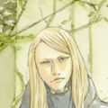

# games_character_ranking

Pixiv-based Game Characters Ranking

The data is refreshed every day.

## Arknights

Top rank list of Arknights ( Full Version: [Safe](https://github.com/narugo1992/games_character_ranking/tree/arknights_safe#overall-ranking) | [R18](https://github.com/narugo1992/games_character_ranking/tree/arknights_r18#overall-ranking) )

|   Rank | Face                                                                                                                                                                                                                                                                                                                                                                                                                                                                        | CN   | JP     | EN            |   All Images |   R18 Images |
|--------|-----------------------------------------------------------------------------------------------------------------------------------------------------------------------------------------------------------------------------------------------------------------------------------------------------------------------------------------------------------------------------------------------------------------------------------------------------------------------------|------|--------|---------------|--------------|--------------|
|      1 | /artworks?order=popular_d&s_mode=s_tag&mode=all)                                                                                                                                                                                                           | 阿米娅  | アーミヤ   | amiya         |        14274 |         1142 |
|      2 | %20-%E5%BE%B7%E5%85%8B%E8%90%A8%E6%96%AF%E5%81%9A%E5%BE%97%E5%88%B0%E5%90%97%20-%E7%BC%84%E9%BB%98%E5%BE%B7%E5%85%8B%E8%90%A8%E6%96%AF%20-%E8%A1%80%E6%8E%9F%E3%83%86%E3%82%AD%E3%82%B5%E3%82%B9/artworks?order=popular_d&s_mode=s_tag&mode=all)  | 德克萨斯 | テキサス   | texas         |        11894 |         1199 |
|      3 |                                                 | W    | W      | w             |         8621 |         1176 |
|      4 | /artworks?order=popular_d&s_mode=s_tag&mode=all)                                                                                                                                                                                                     | 能天使  | エクシア   | exusiai       |         8207 |          733 |
|      5 | %20-skadi_the_corrupting_heart%20-%E6%B5%8A%E5%BF%83%E6%96%AF%E5%8D%A1%E8%92%82%20-%E6%BF%81%E5%BF%83%E3%82%B9%E3%82%AB%E3%82%B8/artworks?order=popular_d&s_mode=s_tag&mode=all)                                                                                    | 斯卡蒂  | スカジ    | skadi         |         7634 |          864 |
|      6 | /artworks?order=popular_d&s_mode=s_tag&mode=all)                                                                                                                                                                       | 拉普兰德 | ラップランド | lappland      |         7442 |          637 |
|      7 | %20-%E3%83%9B%E3%82%B7%E3%83%81%E3%82%A7%E3%83%B3%20-%E5%81%87%E6%97%A5%E5%A8%81%E9%BE%99%E9%99%88%20-%E6%98%9F%E9%99%88%20-%E8%A1%A3%E8%A3%85%E3%83%81%E3%82%A7%E3%83%B3%E3%82%B8%20-%E9%81%8A%E9%BE%8D%E3%83%81%E3%82%A7%E3%83%B3/artworks?order=popular_d&s_mode=s_tag&mode=all) | 陈    | チェン    | ch&#x27;en    |         6467 |          886 |
|      8 | /artworks?order=popular_d&s_mode=s_tag&mode=all)                                                                                                                                                                                                           | 史尔特尔 | スルト    | surtr         |         5694 |          805 |
|      9 | %20-%E5%87%AF%E5%B0%94%E5%B8%8Ckal%27tsit/artworks?order=popular_d&s_mode=s_tag&mode=all)                                                                                                                                                       | 凯尔希  | ケルシー   | kal&#x27;tsit |         5688 |          906 |
|     10 | %20-suzuranourlight/artworks?order=popular_d&s_mode=s_tag&mode=all)                                                                                                                                                                                           | 铃兰   | スズラン   | suzuran       |         5487 |         1157 |

Recent rank list of Arknights ( Full Version: [Safe](https://github.com/narugo1992/games_character_ranking/tree/arknights_safe#recent-ranking) | [R18](https://github.com/narugo1992/games_character_ranking/tree/arknights_r18#recent-ranking) )

|   Rank | Face                                                                                                                                                                                                                                                                                                                                                                                                                                                                                                                                                                                                                                                                                                                                                                                                                                                                                                                                                                                             | CN         | JP    | EN              |   All Images |   R18 Images |
|--------|--------------------------------------------------------------------------------------------------------------------------------------------------------------------------------------------------------------------------------------------------------------------------------------------------------------------------------------------------------------------------------------------------------------------------------------------------------------------------------------------------------------------------------------------------------------------------------------------------------------------------------------------------------------------------------------------------------------------------------------------------------------------------------------------------------------------------------------------------------------------------------------------------------------------------------------------------------------------------------------------------|------------|-------|-----------------|--------------|--------------|
|      1 | %20-angelina%20-elini%20-flint%20-folinic%20-girlsfrontline%20-lineart%20-line%E3%82%B9%E3%82%BF%E3%83%B3%E3%83%97%20-ling%20-%E3%83%80%E3%83%96%E3%83%AA%E3%83%B3%20-%E3%83%89%E3%82%A5%E3%83%AA%E3%83%B3%20-%E3%83%95%E3%83%AA%E3%83%B3%E3%83%88%20-%E3%83%97%E3%83%AA%E3%83%B3%20-%E3%83%AF%E3%83%AB%E3%83%95%E3%82%A1%E3%83%AA%E3%83%B3%20-%E5%8D%8E%E6%B3%95%E6%9E%97%20-%E5%8E%9F%E7%A5%9E%E3%82%A4%E3%83%B3%E3%83%91%E3%82%AF%E3%83%88%E3%82%AF%E3%83%AD%E3%83%AA%E3%83%B3%E3%83%87%20-%E5%AE%88%E6%9E%97%E4%BA%BA%20-%E5%AF%86%E6%9E%97%E3%81%AE%E9%95%B7%20-%E5%B0%8F%E6%9E%97%E3%81%95%E3%82%93%E3%81%A1%E3%81%AE%E3%83%A1%E3%82%A4%E3%83%89%E3%83%A9%E3%82%B4%E3%83%B3%20-%E5%B7%A1%E6%9E%97%E8%80%85%20-%E6%9D%9C%E6%9E%97/artworks?order=popular_d&s_mode=s_tag&mode=all) | 林          | リン    | lin             |          935 |          145 |
|      2 | /artworks?order=popular_d&s_mode=s_tag&mode=all)                                                                                                                                                                                                                                                                                                                                                                                                                                                                                                                                                                                                                                                                                                                                                  | 霍尔海雅       |       | ho&#x27;olheyak |          459 |          141 |
|      3 | %20-arknights_muelsyse/artworks?order=popular_d&s_mode=s_tag&mode=all)                                                                                                                                                                                                                                                                                                                                                                                                                                                                                                                                                                                                                                                                                                                                    | 缪尔赛思       |       | muelsyse        |          409 |           79 |
|      4 | /artworks?order=popular_d&s_mode=s_tag&mode=all)                                                                                                                                                                                                                                                                                                                                                                                                                                                                                                                                                                                                                                                                           | 和弦         | ハーモニー | harmonie        |          219 |           72 |
|      5 | /artworks?order=popular_d&s_mode=s_tag&mode=all)                                                                                                                                                                                                                                                                                                                                                                                                                                                                                                                                                                                                                                                                                                                       | 重岳         | チョンユエ | chongyue        |          182 |           23 |
|      6 | %20-chinese%20-chinese_dress%20-chinesedress%20-chinesemyth%20-chinesetraditionalclothe%20-gothic_and_loneliness%20-happycchinesenewyear2021%20-philippines%20-reinessance%20-valentines%20-wines/artworks?order=popular_d&s_mode=s_tag&mode=all)                                                                                                                                                                                                                                                                                                                                                                                                                                                                                                                                                                              | 伊内丝        |       | ines            |          174 |           38 |
|      7 | %20-%E6%98%8E%E6%97%A5%E6%96%B9%E8%88%9F%E6%8F%90%E4%B8%B0/artworks?order=popular_d&s_mode=s_tag&mode=all)                                                                                                                                                                                                                                                                                                                                                                                                                                                                                                                                                                                                                                                                                                                        | 提丰         |       | typhon          |           85 |           35 |
|      8 |                                                                                                                                                                                                                                                                                                                                                                                                                                                                                                                                                                                                                                                                                                                                                                                                   | U-Official |       | u-official      |           57 |           24 |
|      9 | /artworks?order=popular_d&s_mode=s_tag&mode=all)                                                                                                                                                                                                                                                                                                                                                                                                                                                                                                                                                                                                                                                                                                                                                                                  | 仇白         |       | qiubai          |           53 |           25 |
|     10 | /artworks?order=popular_d&s_mode=s_tag&mode=all)                                                                                                                                                                                                                                                                                                                                                                                                                                                                                                                                                                                                                                                                                                                                                                                  | 空构         |       | spuria          |           25 |           11 |

## Fate/Grand Order

Top rank list of Fate/Grand Order ( Full Version: [Safe](https://github.com/narugo1992/games_character_ranking/tree/fgo_safe#overall-ranking) | [R18](https://github.com/narugo1992/games_character_ranking/tree/fgo_r18#overall-ranking) )

|   Rank | Face                                                                                                                                                                                                                                                                                                                                                                                                                                                                                                                                                                                                                                                                                                                                                                                                                                                                                                                                                                                                                                                                                                                                                                                                                        | CN         | JP            | EN                 |   All Images |   R18 Images |
|--------|-----------------------------------------------------------------------------------------------------------------------------------------------------------------------------------------------------------------------------------------------------------------------------------------------------------------------------------------------------------------------------------------------------------------------------------------------------------------------------------------------------------------------------------------------------------------------------------------------------------------------------------------------------------------------------------------------------------------------------------------------------------------------------------------------------------------------------------------------------------------------------------------------------------------------------------------------------------------------------------------------------------------------------------------------------------------------------------------------------------------------------------------------------------------------------------------------------------------------------|------------|---------------|--------------------|--------------|--------------|
|      1 | %20-%E3%82%AD%E3%83%AA%E3%82%A8%E3%83%A9%E3%82%A4%E3%83%88%E7%8E%9B%E4%BF%AE%C2%B7%E5%9F%BA%E5%88%97%E8%8E%B1%E7%89%B9/artworks?order=popular_d&s_mode=s_tag&mode=all)                                                                                                                                                                                                                                                                                                                                                                                                                                                                                                                                                                                                                                                                                                                                                     | 玛修·基列莱特    | マシュ・キリエライト    | mash_kyrielight    |        30336 |         7211 |
|      2 | [](https://www.pixiv.net/en/tags/Fate%2FGrandOrder%20(jeanne_d_arc_alter%20OR%20%E3%82%B8%E3%83%A3%E3%83%B3%E3%83%8C%E3%82%AA%E3%83%AB%E3%82%BF%20OR%20%E3%82%B8%E3%83%A3%E3%83%B3%E3%83%8C%E3%83%BB%E3%82%AA%E3%83%AB%E3%82%BF%20OR%20%E3%82%B8%E3%83%A3%E3%83%B3%E3%83%8C%E3%83%BB%E3%83%80%E3%83%AB%E3%82%AF%E3%80%94%E3%82%AA%E3%83%AB%E3%82%BF%E3%80%95%20OR%20%E3%82%B8%E3%83%A3%E3%83%B3%E3%83%8C%E3%83%BB%E3%83%80%E3%83%AB%E3%82%AF%E3%83%BB%E3%82%AA%E3%83%AB%E3%82%BF%20OR%20%E8%B4%9E%E5%BE%B7%E3%80%94alter%E3%80%95%20OR%20%E9%82%AA%E3%83%B3%E3%83%8C)%20-%E3%82%B8%E3%83%A3%E3%83%B3%E3%83%8C%E3%83%BB%E3%83%80%E3%83%AB%E3%82%AF%E3%83%BB%E3%82%AA%E3%83%AB%E3%82%BF%E3%83%BB%E3%82%B5%E3%83%B3%E3%82%BF%E3%83%BB%E3%83%AA%E3%83%AA%E3%82%A3/artworks?order=popular_d&s_mode=s_tag&mode=all)                                                                                                                                                                                                                                                                                                                                                    | 贞德〔Alter〕  | ジャンヌ・ダルク〔オルタ〕 | jeanne_d_arc_alter |        22047 |         3866 |
|      3 | %20-%E3%82%A2%E3%83%AB%E3%83%88%E3%83%AA%E3%82%A2%E3%83%BB%E3%83%9A%E3%83%B3%E3%83%89%E3%83%A9%E3%82%B4%E3%83%B3%E3%80%94%E3%82%AA%E3%83%AB%E3%82%BF%E3%80%95%20-%E3%82%A2%E3%83%AB%E3%83%88%E3%83%AA%E3%82%A2%E3%83%BB%E3%83%9A%E3%83%B3%E3%83%89%E3%83%A9%E3%82%B4%E3%83%B3%E3%80%94%E3%82%B5%E3%83%B3%E3%82%BF%E3%82%AA%E3%83%AB%E3%82%BF%E3%80%95%20-%E3%82%A2%E3%83%AB%E3%83%88%E3%83%AA%E3%82%A2%E3%83%BB%E3%83%9A%E3%83%B3%E3%83%89%E3%83%A9%E3%82%B4%E3%83%B3%E3%80%94%E3%83%AA%E3%83%AA%E3%82%A3%E3%80%95%20-%E3%82%A2%E3%83%AB%E3%83%88%E3%83%AA%E3%82%A2%E3%83%BB%E3%83%9A%E3%83%B3%E3%83%89%E3%83%A9%E3%82%B4%E3%83%B3%E3%83%BB%E3%82%AA%E3%83%AB%E3%82%BF%20-%E3%82%A2%E3%83%AB%E3%83%88%E3%83%AA%E3%82%A2%E3%83%BB%E3%83%9A%E3%83%B3%E3%83%89%E3%83%A9%E3%82%B4%E3%83%B3%E3%83%BB%E3%83%AA%E3%83%AA%E3%82%A3/artworks?order=popular_d&s_mode=s_tag&mode=all) | 阿尔托莉雅·潘德拉贡 | アルトリア・ペンドラゴン  | altria_pendragon   |        19882 |         4598 |
|      4 | %20-%E5%86%B2%E7%94%B0%E6%80%BB%E5%8F%B8%E3%80%94alter%E3%80%95%20-%E6%B2%96%E7%94%B0%E7%B7%8F%E5%8F%B8%E3%80%94%E3%82%AA%E3%83%AB%E3%82%BF%E3%80%95%20-%E6%B2%96%E7%94%B0%E7%B7%8F%E5%8F%B8%E3%83%BB%E3%82%AA%E3%83%AB%E3%82%BF/artworks?order=popular_d&s_mode=s_tag&mode=all)                                                                                                                                                                                                                                                                                                                                                                                                                                                                                                                                                                                                                                                                                                                                     | 冲田总司       | 沖田総司          | okita_souji        |        15926 |         1789 |
|      5 | %20-abigail_williams_fate%20-%E3%82%A2%E3%83%93%E3%82%B2%E3%82%A4%E3%83%AB%E3%83%BB%E3%82%A6%E3%82%A3%E3%83%AA%E3%82%A2%E3%83%A0%E3%82%BA%E3%80%94%E5%A4%8F%E3%80%95%20-%E9%98%BF%E6%AF%94%E7%9B%96%E5%B0%94%C2%B7%E5%A8%81%E5%BB%89%E5%A7%86%E6%96%AF%E3%80%94%E5%A4%8F%E3%80%95/artworks?order=popular_d&s_mode=s_tag&mode=all)                                                                                                                                                                                                                                                                                                                                                                                                                                                                                                                                                   | 阿比盖尔·威廉姆斯  | アビゲイル・ウィリアムズ  | abigail_williams   |        14349 |         1746 |
|      6 | %20-%E3%83%8D%E3%83%AD%E3%83%BB%E3%82%AF%E3%83%A9%E3%82%A6%E3%83%87%E3%82%A3%E3%82%A6%E3%82%B9%E3%80%94%E3%83%96%E3%83%A9%E3%82%A4%E3%83%89%E3%80%95%20-%E3%83%8D%E3%83%AD%E3%83%BB%E3%82%AF%E3%83%A9%E3%82%A6%E3%83%87%E3%82%A3%E3%82%A6%E3%82%B9%E3%83%BB%E3%83%96%E3%83%A9%E3%82%A4%E3%83%89/artworks?order=popular_d&s_mode=s_tag&mode=all)                                                                                                                                                                                                                                                                                                                                                                                                                                                                                                                                                                         | 尼禄·克劳狄乌斯   | ネロ・クラウディウス    | nero_claudius      |        12057 |         1993 |
|      7 | /artworks?order=popular_d&s_mode=s_tag&mode=all)                                                                                                                                                                                                                                                                                                                                                                                                                                                                                                                                                                                                                                                                                                                                                                                                                                                                                                                                                                  | 酒吞童子       | 酒呑童子          | shuten_douji       |        11182 |         2342 |
|      8 | /artworks?order=popular_d&s_mode=s_tag&mode=all)                                                                                                                                                                                                                                                                                                                                                                                                                                                                                                                                                                                                                                                                                                                                                                                                                                                                                                                                                                        | 玉藻前        | 玉藻の前          | tamamo_no_mae      |        10618 |         2229 |
|      9 | /artworks?order=popular_d&s_mode=s_tag&mode=all)                                                                                                                                                                                                                                                                                                                                                                                                                                                                                                                                                                                                                                                                                                                                                                                                                                                                                                                                                      | 阿斯托尔福      | アストルフォ        | astolfo            |        10609 |         3295 |
|     10 | %20-scathach_skadi%20-%E3%82%B9%E3%82%AB%E3%82%B5%E3%83%8F%3D%E3%82%B9%E3%82%AB%E3%83%87%E3%82%A3%20-%E6%96%AF%E5%8D%A1%E5%93%88%C2%B7%E6%96%AF%E5%8D%A1%E8%92%82/artworks?order=popular_d&s_mode=s_tag&mode=all)                                                                                                                                                                                                                                                                                                                                                                                                                                                                                                                                                                                                                                                                                                                                                                                                                      | 斯卡哈        | スカサハ          | scathach           |        10456 |         2889 |

Recent rank list of Fate/Grand Order ( Full Version: [Safe](https://github.com/narugo1992/games_character_ranking/tree/fgo_safe#recent-ranking) | [R18](https://github.com/narugo1992/games_character_ranking/tree/fgo_r18#recent-ranking) )

|   Rank | Face                                                                                                                                                                                                                                                                                                                                                                                                                                                                                                                                                                                                       | CN        | JP            | EN                  |   All Images |   R18 Images |
|--------|------------------------------------------------------------------------------------------------------------------------------------------------------------------------------------------------------------------------------------------------------------------------------------------------------------------------------------------------------------------------------------------------------------------------------------------------------------------------------------------------------------------------------------------------------------------------------------------------------------|-----------|---------------|---------------------|--------------|--------------|
|      1 | /artworks?order=popular_d&s_mode=s_tag&mode=all)                                                                                                                                                                                                                                                                                                                                                                              | 高杉晋作      | 高杉晋作          | takasugi_shinsaku   |         1299 |           23 |
|      2 | /artworks?order=popular_d&s_mode=s_tag&mode=all) | 特拉洛克      | トラロック         | tlaloc              |          848 |          129 |
|      3 | /artworks?order=popular_d&s_mode=s_tag&mode=all)                                                                                                                                                                                                                                                                                           | 特斯卡特利波卡   | テスカトリポカ       | tezcatlipoca        |          780 |           13 |
|      4 | /artworks?order=popular_d&s_mode=s_tag&mode=all)                                                                                                                                                                                                                                                                                                                                  | 千利休       | 千利休           | sen_no_rikyu        |          727 |           67 |
|      5 | /artworks?order=popular_d&s_mode=s_tag&mode=all)                                                                                                                                                                                                                                                                                                                                           | 奥特琳德      | オルトリンデ        | ortlinde            |          623 |           92 |
|      6 | /artworks?order=popular_d&s_mode=s_tag&mode=all)                                                                                                                                                                                                    | 所多玛之兽／德拉科 | ソドムズビースト/ドラコー | sodom_s_beast_draco |          577 |          102 |
|      7 | /artworks?order=popular_d&s_mode=s_tag&mode=all)                                                                                                                                                                                                                                                                                                                                                                               | 斯露德       | スルーズ          | thrud               |          481 |           72 |
|      8 | /artworks?order=popular_d&s_mode=s_tag&mode=all)                                                                                                                                                                                                                                                                                                                                                                                 | 山南敬助      | 山南敬助          | yamanami_keisuke    |          470 |           29 |
|      9 | /artworks?order=popular_d&s_mode=s_tag&mode=all)                                  | 格里戈里·拉斯普京 | グレゴリー・ラスプーチン  | grigori_rasputin    |          462 |           18 |
|     10 | /artworks?order=popular_d&s_mode=s_tag&mode=all)                                                                                                                                                                                                                                                                                                                                                                                                     | 希露德       | ヒルド           | hildr               |          411 |           54 |

## Azur Lane

Top rank list of Azur Lane ( Full Version: [Safe](https://github.com/narugo1992/games_character_ranking/tree/azurlane_safe#overall-ranking) | [R18](https://github.com/narugo1992/games_character_ranking/tree/azurlane_r18#overall-ranking) )

|   Rank | Face                                                                                                                                                                                                                                                                                                                                                                                                                                                                         | CN    | JP        | EN          |   All Images |   R18 Images |
|--------|------------------------------------------------------------------------------------------------------------------------------------------------------------------------------------------------------------------------------------------------------------------------------------------------------------------------------------------------------------------------------------------------------------------------------------------------------------------------------|-------|-----------|-------------|--------------|--------------|
|      1 | %20-%E5%A4%A7%E9%B3%B3(%CE%BC%E5%85%B5%E8%A3%85)%20-%E5%A4%A7%E9%B3%B3%E3%81%A1%E3%82%83%E3%82%93%20-%E5%B0%8F%E5%A4%A7%E5%87%A4/artworks?order=popular_d&s_mode=s_tag&mode=all)                                                               | 大凤    | 大鳳        | taiho       |         9318 |         3746 |
|      2 | %20-little_formidable%20-%E3%83%AA%E3%83%88%E3%83%AB%E3%83%BB%E3%83%95%E3%82%A9%E3%83%BC%E3%83%9F%E3%83%80%E3%83%96%E3%83%AB%20-%E5%B0%8F%E5%8F%AF%E7%95%8F/artworks?order=popular_d&s_mode=s_tag&mode=all)       | 可畏    | フォーミダブル   | formidable  |         9128 |         3143 |
|      3 | %20-%E7%A2%A7%E8%93%9D%E8%88%AA%E7%BA%BF%E7%BB%AB%E6%B3%A2%20-%E7%BB%AB%E6%B3%A2%E6%94%B9/artworks?order=popular_d&s_mode=s_tag&mode=all)                                                                                   | 绫波    | 綾波        | ayanami     |         8362 |         1575 |
|      4 | /artworks?order=popular_d&s_mode=s_tag&mode=all)                                                                                                                                                                                           | 爱宕    | 愛宕        | atago       |         8212 |         2820 |
|      5 | /artworks?order=popular_d&s_mode=s_tag&mode=all)                                                                                                                                                         | 贝尔法斯特 | ベルファスト    | belfast     |         7957 |         2685 |
|      6 | %20-%E3%83%97%E3%83%AA%E3%83%B3%E3%83%84%E3%83%BB%E3%82%AA%E3%82%A4%E3%82%B2%E3%83%B3%E3%81%A1%E3%82%83%E3%82%93/artworks?order=popular_d&s_mode=s_tag&mode=all)           | 欧根亲王  | プリンツ・オイゲン | prinz_eugen |         7885 |         2112 |
|      7 | /artworks?order=popular_d&s_mode=s_tag&mode=all)                                                                                                                                                                                    | 独角兽   | ユニコーン     | unicorn     |         7801 |         1926 |
|      8 | %20-uss_bremerton/artworks?order=popular_d&s_mode=s_tag&mode=all)                                                                                                                                           | 布莱默顿  | ブレマートン    | bremerton   |         6854 |         3258 |
|      9 | %20-hms_sirius%20-hmssirius%20-siriusazurlane/artworks?order=popular_d&s_mode=s_tag&mode=all)                                                                                                                                                   | 天狼星   | シリアス      | sirius      |         6702 |         2250 |
|     10 | %20-enterprise_azurlane%20-ussenterprise%20-%E3%83%AA%E3%83%88%E3%83%AB%E3%83%BB%E3%82%A8%E3%83%B3%E3%82%BF%E3%83%BC%E3%83%97%E3%83%A9%E3%82%A4%E3%82%BA/artworks?order=popular_d&s_mode=s_tag&mode=all) | 进取    | エンタープライズ  | enterprise  |         6606 |          873 |

Recent rank list of Azur Lane ( Full Version: [Safe](https://github.com/narugo1992/games_character_ranking/tree/azurlane_safe#recent-ranking) | [R18](https://github.com/narugo1992/games_character_ranking/tree/azurlane_r18#recent-ranking) )

|   Rank | Face                                                                                                                                                                                                                                                                                                                                                                  | CN    | JP       | EN          |   All Images |   R18 Images |
|--------|-----------------------------------------------------------------------------------------------------------------------------------------------------------------------------------------------------------------------------------------------------------------------------------------------------------------------------------------------------------------------|-------|----------|-------------|--------------|--------------|
|      1 | %20-%E7%A2%A7%E8%93%9D%E8%88%AA%E7%BA%BF%E6%80%A8%E4%BB%87/artworks?order=popular_d&s_mode=s_tag&mode=all) | 怨仇    | インプラカブル  | implacable  |         1124 |          464 |
|      2 | %20-kmsregensburg/artworks?order=popular_d&s_mode=s_tag&mode=all)               | 雷根斯堡  | レーゲンスブルク | regensburg  |          251 |           83 |
|      3 | /artworks?order=popular_d&s_mode=s_tag&mode=all)                                                                                                           | 斯库拉   | シラ       | scylla      |          190 |           54 |
|      4 | /artworks?order=popular_d&s_mode=s_tag&mode=all)                                | 伏罗希洛夫 | ヴォロシーロフ  | voroshilov  |          171 |           65 |
|      5 | [&lt;no face detected&gt;](https://www.pixiv.net/en/tags/%E3%82%A2%E3%82%BA%E3%83%BC%E3%83%AB%E3%83%AC%E3%83%BC%E3%83%B3%20(hindenburg%20OR%20%E3%83%92%E3%83%B3%E3%83%87%E3%83%B3%E3%83%96%E3%83%AB%E3%82%AF%20OR%20%E5%85%B4%E7%99%BB%E5%A0%A1)/artworks?order=popular_d&s_mode=s_tag&mode=all)                                                                     | 兴登堡   | ヒンデンブルク  | hindenburg  |          154 |           35 |
|      6 | /artworks?order=popular_d&s_mode=s_tag&mode=all)                                                    | 约克城II | ヨークタウンII | yorktown_ii |          151 |           34 |
|      7 | /artworks?order=popular_d&s_mode=s_tag&mode=all)                                                              | 奇尔沙治  | キアサージ    | kearsarge   |          140 |           33 |
|      8 | %20-jade_harley%20-%E3%83%A4%E3%83%BC%E3%83%87%E7%B4%9A/artworks?order=popular_d&s_mode=s_tag&mode=all)                                                          | 亚德    | ヤーデ      | jade        |          119 |           15 |
|      9 |                                                                                                                                                             | 定安    | 定安       | ting_an     |           77 |           39 |
|     10 | /artworks?order=popular_d&s_mode=s_tag&mode=all)                                                                                   | 百眼巨人  | アーガス     | argus       |           70 |           13 |

## Genshin Impact

Top rank list of Genshin Impact ( Full Version: [Safe](https://github.com/narugo1992/games_character_ranking/tree/genshin_safe#overall-ranking) | [R18](https://github.com/narugo1992/games_character_ranking/tree/genshin_r18#overall-ranking) )

|   Rank | Face                                                                                                                                                                                                                                                                                                                                                    | CN   | JP   | EN             |   All Images |   R18 Images |
|--------|---------------------------------------------------------------------------------------------------------------------------------------------------------------------------------------------------------------------------------------------------------------------------------------------------------------------------------------------------------|------|------|----------------|--------------|--------------|
|      1 | /artworks?order=popular_d&s_mode=s_tag&mode=all)                                                                                                                                             | 甘雨   | 甘雨   | ganyu          |        40550 |        12216 |
|      2 | /artworks?order=popular_d&s_mode=s_tag&mode=all) | 雷电将军 | 雷電将軍 | raiden_shogun  |        33865 |        12024 |
|      3 | /artworks?order=popular_d&s_mode=s_tag&mode=all)                                                                                                                                 | 胡桃   | 胡桃   | hu_tao         |        29672 |         6225 |
|      4 | %20-yaeyae_miko/artworks?order=popular_d&s_mode=s_tag&mode=all)                                                                                          | 八重神子 | 八重神子 | yae_miko       |        24192 |         7736 |
|      5 | /artworks?order=popular_d&s_mode=s_tag&mode=all)                | 神里绫华 | 神里綾華 | kamisato_ayaka |        23471 |         6857 |
|      6 | /artworks?order=popular_d&s_mode=s_tag&mode=all)                                                                                                                                 | 刻晴   | 刻晴   | keqing         |        20433 |         5970 |
|      7 | /artworks?order=popular_d&s_mode=s_tag&mode=all)                                                                                                                        | 纳西妲  | ナヒーダ | nahida         |        17675 |         5360 |
|      8 | %20-scaramona/artworks?order=popular_d&s_mode=s_tag&mode=all)                                                                                                                                            | 莫娜   | モナ   | mona           |        16273 |         5511 |
|      9 | %20-%E3%82%AF%E3%83%AC%E3%83%BC%E3%81%A1%E3%82%83%E3%82%93/artworks?order=popular_d&s_mode=s_tag&mode=all)                                                                                      | 可莉   | クレー  | klee           |        14198 |         2664 |
|     10 | /artworks?order=popular_d&s_mode=s_tag&mode=all)                                                                                                                                       | 优菈   | エウルア | eula           |        13817 |         4937 |

Recent rank list of Genshin Impact ( Full Version: [Safe](https://github.com/narugo1992/games_character_ranking/tree/genshin_safe#recent-ranking) | [R18](https://github.com/narugo1992/games_character_ranking/tree/genshin_r18#recent-ranking) )

|   Rank | Face                                                                                                                                                                                                                                                                                                                                     | CN   | JP     | EN             |   All Images |   R18 Images |
|--------|------------------------------------------------------------------------------------------------------------------------------------------------------------------------------------------------------------------------------------------------------------------------------------------------------------------------------------------|------|--------|----------------|--------------|--------------|
|      1 | %20-yaeyae_miko/artworks?order=popular_d&s_mode=s_tag&mode=all)                                                                           | 八重神子 | 八重神子   | yae_miko       |        24192 |         7736 |
|      2 | /artworks?order=popular_d&s_mode=s_tag&mode=all)                                                                                                         | 纳西妲  | ナヒーダ   | nahida         |        17675 |         5360 |
|      3 | %20-%E3%81%97%E3%82%93%E3%81%8B%E3%81%8F%E6%8D%86%E7%BB%91/artworks?order=popular_d&s_mode=s_tag&mode=all)                              | 申鹤   | 申鶴     | shenhe         |        11631 |         3758 |
|      4 | /artworks?order=popular_d&s_mode=s_tag&mode=all)                                                                                                                     | 妮露   | ニィロウ   | nilou          |         9428 |         2833 |
|      5 | /artworks?order=popular_d&s_mode=s_tag&mode=all)                                                                                           | 夜兰   | 夜蘭     | yelan          |         9221 |         3067 |
|      6 | %20-%E5%8E%9F%E7%A5%9E%E6%B5%81%E6%B5%AA%E8%80%85/artworks?order=popular_d&s_mode=s_tag&mode=all)                                                           | 流浪者  | 放浪者    | wanderer       |         5733 |          449 |
|      7 | /artworks?order=popular_d&s_mode=s_tag&mode=all) | 神里绫人 | 神里綾人   | kamisato_ayato |         4136 |          436 |
|      8 | /artworks?order=popular_d&s_mode=s_tag&mode=all)                                                                     | 艾尔海森 | アルハイゼン | alhaitham      |         3917 |          577 |
|      9 | /artworks?order=popular_d&s_mode=s_tag&mode=all)                                                                                                   | 提纳里  | ティナリ   | tighnari       |         3751 |          376 |
|     10 | %20-fixdehya/artworks?order=popular_d&s_mode=s_tag&mode=all)                                                                                                | 迪希雅  | ディシア   | dehya          |         3122 |         1163 |

## Girls' Frontline

Top rank list of Girls' Frontline ( Full Version: [Safe](https://github.com/narugo1992/games_character_ranking/tree/girlsfrontline_safe#overall-ranking) | [R18](https://github.com/narugo1992/games_character_ranking/tree/girlsfrontline_r18#overall-ranking) )

|   Rank | Face                                                                                                                                                                                                                                                                                                                                                                                                                                                   | CN         | JP         | EN           |   All Images |   R18 Images |
|--------|--------------------------------------------------------------------------------------------------------------------------------------------------------------------------------------------------------------------------------------------------------------------------------------------------------------------------------------------------------------------------------------------------------------------------------------------------------|------------|------------|--------------|--------------|--------------|
|      1 | %20-416c%20-416g11%20-416%E3%83%9E%E3%83%9E%20-45416%20-ak416%20-%E3%82%A8%E3%83%BC%E3%82%B8%E3%82%A7%E3%83%B3%E3%83%88416%20-%E6%9C%AC%E5%BD%93%E3%81%AF%E6%80%96%E3%81%84416%E6%95%99%20-%E7%89%B9%E5%B7%A5416/artworks?order=popular_d&s_mode=s_tag&mode=all) | HK416      | 416        | 416          |        12667 |         1788 |
|      2 |                                                                                                                                                                                                                           | UMP45      | UMP45      | ump45        |         8432 |          912 |
|      3 |                                                                                                                                                                                                                              | UMP9       | UMP9       | ump9         |         4882 |          465 |
|      4 |                                                                                                                                                                                                                        | WA2000     | WA2000     | wa2000       |         4097 |          551 |
|      5 | /artworks?order=popular_d&s_mode=s_tag&mode=all)                                                                                                                                                                                             | G11        | GrG11      | gr_g11       |         3866 |          328 |
|      6 |                                                                                                                                                                                                                 | M4A1       | M4A1       | m4a1         |         3213 |          294 |
|      7 | %20-m4sopmodii_mod3%20-m4sopmodiijr/artworks?order=popular_d&s_mode=s_tag&mode=all)                                                                                                                                              | M4SOPMODII | M4SOPMODII | m4_sopmod_ii |         3127 |          267 |
|      8 | /artworks?order=popular_d&s_mode=s_tag&mode=all)                                                                                                                                                                                                           | AK-12      | AK-12      | ak_12        |         2952 |          370 |
|      9 |                                                                                                                                                                                                                              | M200       | M200       | m200         |         2865 |          314 |
|     10 | %20-%E6%98%A5%E7%94%B0%E3%81%AA%E3%81%AA/artworks?order=popular_d&s_mode=s_tag&mode=all)                                  | 春田         | スプリングフィールド | springfield  |         2828 |          423 |

Recent rank list of Girls' Frontline ( Full Version: [Safe](https://github.com/narugo1992/games_character_ranking/tree/girlsfrontline_safe#recent-ranking) | [R18](https://github.com/narugo1992/games_character_ranking/tree/girlsfrontline_r18#recent-ranking) )

|   Rank | Face                                                                                                                                                                                                                                                                                                                                                                                                                                         | CN      | JP   | EN   |   All Images |   R18 Images |
|--------|----------------------------------------------------------------------------------------------------------------------------------------------------------------------------------------------------------------------------------------------------------------------------------------------------------------------------------------------------------------------------------------------------------------------------------------------|---------|------|------|--------------|--------------|
|      1 |                                                                                                                                                                                                                  | SCAR-L  |      |      |           81 |            5 |
|      2 |                                                                                                                                                                                                                | SCAR-H  |      |      |           71 |            1 |
|      3 |                                                                                                                                                                                                                 | AR-18   |      |      |           39 |            1 |
|      4 |                                                                                                                                                     | SCR     | SCR  | scr  |           28 |            4 |
|      5 |  | Erma    |      |      |           18 |            0 |
|      6 |                                                                                                                                                                                                                 | MK3A1   |      |      |           12 |            0 |
|      7 |                                                                                                                                                                                                                 | M240L   |      |      |           11 |            1 |
|      8 |                                                                                                                                                                                                                 | APC9K   |      |      |            9 |            1 |
|      9 | /artworks?order=popular_d&s_mode=s_tag&mode=all)                                                                                                                                                    | 柯尔特沃克   |      |      |            9 |            0 |
|     10 |                                                                                                                                                                                                               | SPAS-15 |      |      |            8 |            0 |

## Neural Cloud

Top rank list of Neural Cloud ( Full Version: [Safe](https://github.com/narugo1992/games_character_ranking/tree/neuralcloud_safe#overall-ranking) | [R18](https://github.com/narugo1992/games_character_ranking/tree/neuralcloud_r18#overall-ranking) )

|   Rank | Face                                                                                                                                                                                                                                                                                                                                                                                                                                                                                                                                                                                              | CN   | JP     | EN         |   All Images |   R18 Images |
|--------|---------------------------------------------------------------------------------------------------------------------------------------------------------------------------------------------------------------------------------------------------------------------------------------------------------------------------------------------------------------------------------------------------------------------------------------------------------------------------------------------------------------------------------------------------------------------------------------------------|------|--------|------------|--------------|--------------|
|      1 | /artworks?order=popular_d&s_mode=s_tag&mode=all)                                                                                                                                                                                                                                                 | 芙洛伦  | フローレンス | florence   |          248 |           37 |
|      2 | /artworks?order=popular_d&s_mode=s_tag&mode=all)                                                                                                                                                                                                                                                                                       | 帕斯卡  | ペルシカ   | persicaria |          221 |           24 |
|      3 | %20-%E3%82%AF%E3%83%AD%E3%82%B9%E3%82%AA%E3%83%BC%E3%83%90%E3%83%BC%20-%E3%82%AF%E3%83%AD%E3%83%83%E3%82%AF%20-%E3%82%AF%E3%83%AD%E3%83%88%20-%E3%82%AF%E3%83%AD%E3%83%BC%E3%83%88%E3%83%BC%20-%E3%82%B3%E3%83%83%E3%82%AF%E3%83%AD%E3%83%BC%E3%83%81%20-%E3%83%9E%E3%82%A4%E3%82%AF%E3%83%AD%E3%83%93%E3%82%AD%E3%83%8B/artworks?order=popular_d&s_mode=s_tag&mode=all) | 卡萝   | クロ     | kuro       |          148 |           13 |
|      4 | /artworks?order=popular_d&s_mode=s_tag&mode=all)                                                                                                                                                                                                                                                                                                   | 克罗琦  | クロック   | croque     |          103 |           10 |
|      5 | /artworks?order=popular_d&s_mode=s_tag&mode=all)                                                                                                                                                                                                                                                                                       | 德菈赛  | ドレーシー  | delacey    |           90 |           21 |
|      6 | /artworks?order=popular_d&s_mode=s_tag&mode=all)                                                                                                                                                                                                                                                                                                                       | 可露凯  |        | clukay     |           88 |           10 |
|      7 | /artworks?order=popular_d&s_mode=s_tag&mode=all)                                                                                                                                                                                                                                                                                                                                                        | 七花   | 七花     | nanaka     |           73 |            3 |
|      8 | /artworks?order=popular_d&s_mode=s_tag&mode=all)                                                                                                                                                                                                                                                                                                             | 贝蒂   | ベティ    | betty      |           72 |           18 |
|      9 | /artworks?order=popular_d&s_mode=s_tag&mode=all)                                                                                                                                                                                                                                                                                                                  | 初尘   | 初塵     | hatsuchiri |           70 |            3 |
|     10 | /artworks?order=popular_d&s_mode=s_tag&mode=all)                                                                                                                                                                                                                                                                  | 安冬妮娜 | アントニーナ | antonina   |           68 |           10 |

Recent rank list of Neural Cloud ( Full Version: [Safe](https://github.com/narugo1992/games_character_ranking/tree/neuralcloud_safe#recent-ranking) | [R18](https://github.com/narugo1992/games_character_ranking/tree/neuralcloud_r18#recent-ranking) )

|   Rank | Face                                                                                                                                                                                                                                                                                                                | CN    | JP    | EN          |   All Images |   R18 Images |
|--------|---------------------------------------------------------------------------------------------------------------------------------------------------------------------------------------------------------------------------------------------------------------------------------------------------------------------|-------|-------|-------------|--------------|--------------|
|      1 | /artworks?order=popular_d&s_mode=s_tag&mode=all)                                         | 可露凯   |       | clukay      |           88 |           10 |
|      2 | /artworks?order=popular_d&s_mode=s_tag&mode=all)               | 黛烟    | 黛煙    | daiyan      |           37 |            2 |
|      3 | /artworks?order=popular_d&s_mode=s_tag&mode=all)                                                                                | 野良    |       | nora        |           27 |            7 |
|      4 | /artworks?order=popular_d&s_mode=s_tag&mode=all)               | 贺莉斯   | ヘリックス | helix       |           18 |            1 |
|      5 | /artworks?order=popular_d&s_mode=s_tag&mode=all)                                                      | 琳德    |       | lind        |           16 |            4 |
|      6 | /artworks?order=popular_d&s_mode=s_tag&mode=all)                                                                          | 图灵    |       | turing      |           16 |            3 |
|      7 | /artworks?order=popular_d&s_mode=s_tag&mode=all)                                      | 玛吉西尔达 |       | magnhilda   |           16 |            0 |
|      8 | /artworks?order=popular_d&s_mode=s_tag&mode=all) | 莎克拉戈  |       | sockdolager |           12 |            3 |
|      9 | /artworks?order=popular_d&s_mode=s_tag&mode=all)                                      | 绛雨    |       | jiangyu     |           12 |            2 |
|     10 | /artworks?order=popular_d&s_mode=s_tag&mode=all)                           | 娜希塔   | ナシタ   | nascita     |            9 |            0 |

## Blue Archive

Top rank list of Blue Archive ( Full Version: [Safe](https://github.com/narugo1992/games_character_ranking/tree/bluearchive_safe#overall-ranking) | [R18](https://github.com/narugo1992/games_character_ranking/tree/bluearchive_r18#overall-ranking) )

|   Rank | Face                                                                                                                                                                                                                                                                                                                                                                                                                                                                                                                                                                                                                                                                                                                                                                                                                                             | CN   | JP     | EN      |   All Images |   R18 Images |
|--------|--------------------------------------------------------------------------------------------------------------------------------------------------------------------------------------------------------------------------------------------------------------------------------------------------------------------------------------------------------------------------------------------------------------------------------------------------------------------------------------------------------------------------------------------------------------------------------------------------------------------------------------------------------------------------------------------------------------------------------------------------------------------------------------------------------------------------------------------------|------|--------|---------|--------------|--------------|
|      1 | %20-asuna_ichinose%20-asunaichinose%20-asunalchinose%20-ichinoseasuna%20-%E4%B8%80%E4%B9%8B%E6%BF%91%E6%98%8E%E6%97%A5%E5%A5%88%20-%E4%B8%80%E4%B9%8B%E7%80%A8%E6%98%8E%E6%97%A5%E5%A5%88%20-%E7%B5%90%E5%9F%8E%E6%98%8E%E6%97%A5%E5%A5%88/artworks?order=popular_d&s_mode=s_tag&mode=all)                                                                                                                                                                                                              | 明日奈  | 一之瀬アスナ | asuna   |        14539 |         5304 |
|      2 | %20-ayaseyuuka%20-bluearchiveyuuka%20-hayaseyuuka%20-yuukabluearchive%20-yuukahayase%20-%E6%97%A9%E6%BF%91%E4%BC%98%E9%A6%99%20-%E6%97%A9%E7%80%AC%E4%BC%98%E9%A6%99/artworks?order=popular_d&s_mode=s_tag&mode=all)                                                                                                                                                                                                                                                                                                                 | 优香   | 早瀬ユウカ  | yuuka   |        11852 |         3071 |
|      3 | %20-sunaookamishiroko%20-suna%C5%8Dkamishiroko%20-%E7%A0%82%E7%8B%BC%E7%99%BD%E5%AD%90%20-%E9%BB%91%E7%99%BD%E5%AD%90/artworks?order=popular_d&s_mode=s_tag&mode=all)                                                                                                                                                                                                                                                                                                                                                                                                          | 白子   | 砂狼シロコ  | shiroko |        10577 |         2239 |
|      4 | %20-tendouarisu/artworks?order=popular_d&s_mode=s_tag&mode=all)                                                                                                                                                                                                                                                                                                                                                                                                                                                             | 爱丽丝  | 天童アリス  | arisu   |         8808 |         1571 |
|      5 | %20-asumatoki%20-%E3%83%90%E3%83%8B%E3%83%BC%E3%83%88%E3%82%AD%E5%85%94%E5%A5%B3%E9%83%8E%E6%97%B6%20-%E5%B0%8F%E6%97%B6%20-%E6%97%B6%E9%9B%A8%20-%E6%98%AD%E5%92%8C%E6%97%B6%E4%BB%A3%20-%E9%87%8E%E4%BA%BA%E6%97%B6%E4%BB%A3%20-%E9%A3%9B%E9%B3%A5%E9%A6%AC%E3%83%88%E3%82%AD%E6%97%B6%20-%E9%A3%9E%E9%A9%AC%E9%B8%9F%E6%97%B6%20-%E9%A3%9E%E9%B8%9F%E9%A9%AC%E6%97%B6/artworks?order=popular_d&s_mode=s_tag&mode=all)                                                                                                                                                                                | 时    | 飛鳥馬トキ  | toki    |         8522 |         2075 |
|      6 | %20-takanashihoshino%20-%E5%B0%8F%E9%B3%A5%E6%B8%B8%E6%98%9F%E9%87%8E%20-%E5%B0%8F%E9%B3%A5%E9%81%8A%E3%81%9F%E3%81%8B%E3%81%AA%E3%81%97%E3%83%9B%E3%82%B7%E3%83%8E%20-%E5%B0%8F%E9%B3%A5%E9%81%8A%E6%98%9F%E9%87%8E%20-%E5%B0%8F%E9%B8%9F%E6%98%9F%E9%87%8E%E6%B8%B8%20-%E5%B0%8F%E9%B8%9F%E6%B8%B8%E6%98%9F%E9%87%8E%20-%E6%98%9F%E9%87%8E%E3%82%A2%E3%82%A4%20-%E6%98%9F%E9%87%8E%E3%83%AB%E3%83%93%E3%83%BC%20-%E6%B0%B4%E6%98%9F%E9%87%8E/artworks?order=popular_d&s_mode=s_tag&mode=all) | 星野   | 小鳥遊ホシノ | hoshino |         8035 |         1436 |
|      7 | %20-mikamo_neru%20-mikamoneru%20-misonomika/artworks?order=popular_d&s_mode=s_tag&mode=all)                                                                                                                                                                                                                                                                                                                                                                                                                                                                                                                                      | 未花   | 聖園ミカ   | mika    |         7515 |         1081 |
|      8 | %20-china%20-chinatsu%20-hinasorasaki%20-hinata%20-sorasakihina%20-tsuchinagahiyori%20-%E4%B8%80%E4%B9%8B%E7%80%AC%E6%98%8E%E6%97%A5%E5%A5%88%20-%E6%97%A5%E5%A5%88%E6%A3%AE%E4%BA%9C%E5%A4%A2%20-%E6%98%8E%E6%97%A5%E5%A5%88%20-%E7%A9%BA%E5%B4%8E%E9%98%B3%E5%A5%88/artworks?order=popular_d&s_mode=s_tag&mode=all)                                                                                                                                                                                                          | 日奈   | 空崎ヒナ   | hina    |         7417 |         1631 |
|      9 | %20-kakudatekarin%20-karinkakudate%20-%E8%A7%92%E6%A5%AF%E8%8A%B1%E5%87%9B/artworks?order=popular_d&s_mode=s_tag&mode=all)                                                                                                                                                                                                                                                                                                                                                                                                                                                              | 花凛   | 角楯カリン  | karin   |         6570 |         2216 |
|     10 | %20-shimoekoharu%20-%E3%82%B3%E3%83%8F%E3%83%ABkoharu%20-%E5%B0%8F%E6%98%A5%E5%85%AD%E8%8A%B1/artworks?order=popular_d&s_mode=s_tag&mode=all)                                                                                                                                                                                                                                                                                                                                                                                             | 小春   | 下江コハル  | koharu  |         6554 |         1608 |

Recent rank list of Blue Archive ( Full Version: [Safe](https://github.com/narugo1992/games_character_ranking/tree/bluearchive_safe#recent-ranking) | [R18](https://github.com/narugo1992/games_character_ranking/tree/bluearchive_r18#recent-ranking) )

|   Rank | Face                                                                                                                                                                                                                                                                                                                                                                                                                                                                                                                                                                                                                                                              | CN   | JP    | EN     |   All Images |   R18 Images |
|--------|-------------------------------------------------------------------------------------------------------------------------------------------------------------------------------------------------------------------------------------------------------------------------------------------------------------------------------------------------------------------------------------------------------------------------------------------------------------------------------------------------------------------------------------------------------------------------------------------------------------------------------------------------------------------|------|-------|--------|--------------|--------------|
|      1 | %20-asumatoki%20-%E3%83%90%E3%83%8B%E3%83%BC%E3%83%88%E3%82%AD%E5%85%94%E5%A5%B3%E9%83%8E%E6%97%B6%20-%E5%B0%8F%E6%97%B6%20-%E6%97%B6%E9%9B%A8%20-%E6%98%AD%E5%92%8C%E6%97%B6%E4%BB%A3%20-%E9%87%8E%E4%BA%BA%E6%97%B6%E4%BB%A3%20-%E9%A3%9B%E9%B3%A5%E9%A6%AC%E3%83%88%E3%82%AD%E6%97%B6%20-%E9%A3%9E%E9%A9%AC%E9%B8%9F%E6%97%B6%20-%E9%A3%9E%E9%B8%9F%E9%A9%AC%E6%97%B6/artworks?order=popular_d&s_mode=s_tag&mode=all) | 时    | 飛鳥馬トキ | toki   |         8522 |         2075 |
|      2 | %20-mikamo_neru%20-mikamoneru%20-misonomika/artworks?order=popular_d&s_mode=s_tag&mode=all)                                                                                                                                                                                                                                                                                                                                                       | 未花   | 聖園ミカ  | mika   |         7515 |         1081 |
|      3 | %20-dailynoa%20-noai%20-ushionoa%20-%E7%94%9F%E7%9B%90%E4%B9%83%E7%88%B1/artworks?order=popular_d&s_mode=s_tag&mode=all)                                                                                                                                                                                                                                                                                                     | 诺亚   | 生塩ノア  | noa    |         3141 |          753 |
|      4 | %20-kyouyamakazusa%20-kyoyamakazusa%20-%E6%9D%8F%E5%B1%B1%E5%92%8C%E7%BA%B1/artworks?order=popular_d&s_mode=s_tag&mode=all)                                                                                                                                                                                                                                                                           | 和纱   | 杏山カズサ | kazusa |         3082 |          566 |
|      5 | %20-jomaesaori%20-joumaesaori%20-saorijoumae%20-%E9%94%AD%E5%89%8D%E7%BA%B1%E7%BB%87/artworks?order=popular_d&s_mode=s_tag&mode=all)                                                                                                                                                                                                                                                                        | 纱织   | 錠前サオリ | saori  |         2767 |          545 |
|      6 | %20-bluearchivekokona%20-sunoharakokona%20-%E6%98%A5%E5%8E%9F%E5%BF%83%E5%A5%88/artworks?order=popular_d&s_mode=s_tag&mode=all)                                                                                                                                                                     | 心奈   | 春原ココナ | kokona |         1910 |          663 |
|      7 | %20-%E5%B0%BE%E5%88%83%E5%BA%B7%E5%A8%9C/artworks?order=popular_d&s_mode=s_tag&mode=all)                                                                                                                                                                                                                                                                                                                    | 康娜   | 尾刃カンナ | kanna  |         1784 |          372 |
|      8 | %20-uzawareisa%20-%E5%AE%87%E6%B3%BD%E7%8E%B2%E7%BA%B1/artworks?order=popular_d&s_mode=s_tag&mode=all)                                                                                                                                                                                                                                                                                                      | 玲纱   | 宇沢レイサ | reisa  |         1454 |          172 |
|      9 | %20-kazekuramoe%20-moekazekura%20-sashiro_tomoe%20-shimoe%20-shimoekoharu%20-tomoe%20-%E3%83%A2%E3%82%A8moe%20-%E9%A3%8E%E4%BB%93%E8%90%8C%E7%BB%98/artworks?order=popular_d&s_mode=s_tag&mode=all)                                                                                                                                                                                                                       | 萌绘   | 風倉モエ  | moe    |         1298 |          469 |
|     10 | /artworks?order=popular_d&s_mode=s_tag&mode=all)                                                                                                                                                                                                                                                                                                                             | 亚津子  | 秤アツコ  | atsuko |         1237 |          127 |

## Path To Nowhere

Top rank list of Path To Nowhere ( Full Version: [Safe](https://github.com/narugo1992/games_character_ranking/tree/pathtonowhere_safe#overall-ranking) | [R18](https://github.com/narugo1992/games_character_ranking/tree/pathtonowhere_r18#overall-ranking) )

|   Rank | Face                                                                                                                                                                                                                                                                                                          | CN   | JP    | EN       |   All Images |   R18 Images |
|--------|---------------------------------------------------------------------------------------------------------------------------------------------------------------------------------------------------------------------------------------------------------------------------------------------------------------|------|-------|----------|--------------|--------------|
|      1 | /artworks?order=popular_d&s_mode=s_tag&mode=all)                                                                                    | 卓娅   | ゾーヤ   | zoya     |          120 |            5 |
|      2 | %20-%E3%83%98%E3%83%A9%E3%83%BC%20-%E6%97%A0%E6%9C%9F%E8%BF%B7%E9%80%94%E6%B5%B7%E6%8B%89/artworks?order=popular_d&s_mode=s_tag&mode=all) | 海拉   | ヘラ    | hella    |           69 |            3 |
|      3 | /artworks?order=popular_d&s_mode=s_tag&mode=all)                                                            | 赫卡蒂  | ヘカテー  | hecate   |           54 |            0 |
|      4 | %20-chelsea%20-%E3%83%8F%E3%82%AF%E6%BE%88%20-%E6%BE%88%E5%B1%80/artworks?order=popular_d&s_mode=s_tag&mode=all)                                         | 澈    | 澈     | che      |           43 |            2 |
|      5 | /artworks?order=popular_d&s_mode=s_tag&mode=all)                                                         | 兰利   | ラングリー | langley  |           41 |            5 |
|      6 | /artworks?order=popular_d&s_mode=s_tag&mode=all)                                                                        | 白逸   | ハクイツ  | baiyi    |           32 |            3 |
|      7 | /artworks?order=popular_d&s_mode=s_tag&mode=all)                                                               | 辰砂   | 辰砂    | cinnabar |           29 |            3 |
|      8 | /artworks?order=popular_d&s_mode=s_tag&mode=all)                                                                        | 迪蒙   | デーモン  | demon    |           25 |            1 |
|      9 | %20-%E6%97%A0%E6%9C%9F%E8%BF%B7%E9%80%94%E5%A8%9C%E6%81%B0/artworks?order=popular_d&s_mode=s_tag&mode=all)                 | 娜恰   | ナチャ   | serpent  |           24 |            0 |
|     10 | /artworks?order=popular_d&s_mode=s_tag&mode=all)                                                                                                                 | 诺克斯  | NOX   | nox      |           22 |            0 |

Recent rank list of Path To Nowhere ( Full Version: [Safe](https://github.com/narugo1992/games_character_ranking/tree/pathtonowhere_safe#recent-ranking) | [R18](https://github.com/narugo1992/games_character_ranking/tree/pathtonowhere_r18#recent-ranking) )

|   Rank | Face                                                                                                                                                                                                                                                                                                                                                                                                                                                                                                                                           | CN   | JP     | EN        |   All Images |   R18 Images |
|--------|------------------------------------------------------------------------------------------------------------------------------------------------------------------------------------------------------------------------------------------------------------------------------------------------------------------------------------------------------------------------------------------------------------------------------------------------------------------------------------------------------------------------------------------------|------|--------|-----------|--------------|--------------|
|      1 | %20-chelsea%20-%E3%83%8F%E3%82%AF%E6%BE%88%20-%E6%BE%88%E5%B1%80/artworks?order=popular_d&s_mode=s_tag&mode=all)                                                                                                                                                                                                                                                                          | 澈    | 澈      | che       |           43 |            2 |
|      2 | /artworks?order=popular_d&s_mode=s_tag&mode=all)                                                                                                                                                                                                                                                                                                | 辰砂   | 辰砂     | cinnabar  |           29 |            3 |
|      3 | %20-%E6%97%A0%E6%9C%9F%E8%BF%B7%E9%80%94%E5%A8%9C%E6%81%B0/artworks?order=popular_d&s_mode=s_tag&mode=all)                                                                                                                                                                                                                                                  | 娜恰   | ナチャ    | serpent   |           24 |            0 |
|      4 | /artworks?order=popular_d&s_mode=s_tag&mode=all)                                                                                                                                                                                                                                                                                                                                                  | 诺克斯  | NOX    | nox       |           22 |            0 |
|      5 | %20-%E3%82%AB%E3%83%A1%E3%83%AA%E3%82%A2%E3%83%B3%20-%E3%83%8F%E3%82%A4%E3%82%A2%E3%83%B3%E3%82%B0%E3%83%AB%20-%E3%83%AD%E3%82%B7%E3%82%A2%E3%83%B3%E3%83%AB%E3%83%BC%E3%83%AC%E3%83%83%E3%83%88%20-%E5%8D%A1%E7%B1%B3%E5%88%A9%E5%AE%89%20-%E9%A1%94%E3%81%8C%E6%80%96%E3%81%84%E3%81%A7%E3%81%99%E3%82%A2%E3%83%B3%E3%81%95%E3%82%93/artworks?order=popular_d&s_mode=s_tag&mode=all) | 安    | アン     | anne      |           18 |            0 |
|      6 | %20-%E3%83%AC%E3%83%B4%E3%82%A3%E5%B1%80/artworks?order=popular_d&s_mode=s_tag&mode=all)                                                                                                                                                                                                                                                                             | 李维   | レヴィ    | levy      |           15 |            0 |
|      7 | /artworks?order=popular_d&s_mode=s_tag&mode=all)                                                                                                                                                                                                                                                                                 | 麦昆   | マックイーン | mcqueen   |           14 |            1 |
|      8 | /artworks?order=popular_d&s_mode=s_tag&mode=all)                                                                                                                                                                                                                                                                           | 卡瓦卡瓦 | カワカワ   | kava-kava |            6 |            0 |
|      9 | /artworks?order=popular_d&s_mode=s_tag&mode=all)                                                                                                                                                                                                                                                                           | 玛奇朵  | マキアート  | macchiato |            6 |            0 |
|     10 | /artworks?order=popular_d&s_mode=s_tag&mode=all)                                                                                                                                                                                                                                                                                                                     | 丽莎   | リザー    | lisa      |            5 |            1 |

## Nikke: Goddess Of Victory

Top rank list of Nikke: Goddess of Victory ( Full Version: [Safe](https://github.com/narugo1992/games_character_ranking/tree/nikke_safe#overall-ranking) | [R18](https://github.com/narugo1992/games_character_ranking/tree/nikke_r18#overall-ranking) )

|   Rank | Face                                                                                                                                                                                                                                                                                                                                                                                                                                                                                                 | CN   | JP    | EN      |   All Images |   R18 Images |
|--------|------------------------------------------------------------------------------------------------------------------------------------------------------------------------------------------------------------------------------------------------------------------------------------------------------------------------------------------------------------------------------------------------------------------------------------------------------------------------------------------------------|------|-------|---------|--------------|--------------|
|      1 | %20-%E3%82%A2%E3%83%8B%E3%82%B9%EF%BC%9A%E3%82%B9%E3%83%91%E3%83%BC%E3%82%AF%E3%83%AA%E3%83%B3%E3%82%B0%E3%82%B5%E3%83%9E%E3%83%BC/artworks?order=popular_d&s_mode=s_tag&mode=all)                                                                                                               | 阿妮斯  | アニス   | anis    |         2098 |         1100 |
|      2 |                                                                                                          | D    | D     | d       |         2067 |         1050 |
|      3 | %20-%E5%A4%A9%E7%AB%A5%E3%82%A2%E3%83%AA%E3%82%B9/artworks?order=popular_d&s_mode=s_tag&mode=all)                                                                                                                                                                                             | 爱丽丝  | アリス   | alice   |         1977 |          952 |
|      4 | /artworks?order=popular_d&s_mode=s_tag&mode=all)                                                                                                                                                                                                                                                                   | 拉毗   | ラピ    | rapi    |         1493 |          684 |
|      5 | %20-helmnikke/artworks?order=popular_d&s_mode=s_tag&mode=all)                                                                                                                                                                                                                                             | 海伦   | ヘルム   | helm    |          721 |          337 |
|      6 | %20-%E3%83%AB%E3%83%94%E3%83%BC%EF%BC%9A%E3%82%A6%E3%82%A3%E3%83%B3%E3%82%BF%E3%83%BC%E3%82%B7%E3%83%A7%E3%83%83%E3%83%91%E3%83%BC%20-%E8%81%96%E8%AA%95%E9%9C%B2%E8%8F%B2%20-%E9%9C%B2%E8%8F%B2%EF%BC%9A%E5%86%AC%E6%97%A5%E8%B4%AD%E7%89%A9%E7%8B%82/artworks?order=popular_d&s_mode=s_tag&mode=all) | 露菲   | ルピー   | rupee   |          721 |          300 |
|      7 | /artworks?order=popular_d&s_mode=s_tag&mode=all)                                                                                                                                                                                                                                              | 毒蛇   | バイパー  | viper   |          679 |          280 |
|      8 | %20-bride/artworks?order=popular_d&s_mode=s_tag&mode=all)                                                                                                                                                                                                                               | 布丽德  | ブリッド  | brid    |          436 |          173 |
|      9 | /artworks?order=popular_d&s_mode=s_tag&mode=all)                                                                                                                                                                                                                               | 桃乐丝  | ドロシー  | dorothy |          399 |          147 |
|     10 | /artworks?order=popular_d&s_mode=s_tag&mode=all)                                                                                                                                                                                                                         | 沃纶姆  | ボリューム | volume  |          387 |          180 |

Recent rank list of Nikke: Goddess of Victory ( Full Version: [Safe](https://github.com/narugo1992/games_character_ranking/tree/nikke_safe#recent-ranking) | [R18](https://github.com/narugo1992/games_character_ranking/tree/nikke_r18#recent-ranking) )

|   Rank | Face                                                                                                                                                                                                                                                                                                                                                                                         | CN   | JP    | EN       |   All Images |   R18 Images |
|--------|----------------------------------------------------------------------------------------------------------------------------------------------------------------------------------------------------------------------------------------------------------------------------------------------------------------------------------------------------------------------------------------------|------|-------|----------|--------------|--------------|
|      1 |  | D    | D     | d        |         2067 |         1050 |
|      2 | %20-helmnikke/artworks?order=popular_d&s_mode=s_tag&mode=all)                                                                                                                                     | 海伦   | ヘルム   | helm     |          721 |          337 |
|      3 | /artworks?order=popular_d&s_mode=s_tag&mode=all)                                                                                                                                      | 毒蛇   | バイパー  | viper    |          679 |          280 |
|      4 | /artworks?order=popular_d&s_mode=s_tag&mode=all)                                                                                                                       | 桃乐丝  | ドロシー  | dorothy  |          399 |          147 |
|      5 | /artworks?order=popular_d&s_mode=s_tag&mode=all)                                                                                                                                      | 布兰儿  | ブラン   | blanc    |          351 |          146 |
|      6 | /artworks?order=popular_d&s_mode=s_tag&mode=all)                                                                                                                                                  | 索达   | ソーダ   | soda     |          295 |          137 |
|      7 | /artworks?order=popular_d&s_mode=s_tag&mode=all)                                                                                                                                | 诺亚尔  | ノワール  | noir     |          284 |          132 |
|      8 | %20-nikkemodernia/artworks?order=popular_d&s_mode=s_tag&mode=all)                                                                                                            | 神罚   | モダニア  | modernia |          256 |           66 |
|      9 | /artworks?order=popular_d&s_mode=s_tag&mode=all)                                                                                                                          | 豺狼   | ジャッカル | jackal   |          171 |           71 |
|     10 | /artworks?order=popular_d&s_mode=s_tag&mode=all)                                                                                                              | 拉普拉斯 | ラプラス  | laplace  |          153 |           34 |

## Honkai: Star Rail

Top rank list of Honkai: Star Rail ( Full Version: [Safe](https://github.com/narugo1992/games_character_ranking/tree/starrail_safe#overall-ranking) | [R18](https://github.com/narugo1992/games_character_ranking/tree/starrail_r18#overall-ranking) )

|   Rank | Face                                                                                                                                                                                                                                                                                                                                                                                     | CN     | JP    | EN          |   All Images |   R18 Images |
|--------|------------------------------------------------------------------------------------------------------------------------------------------------------------------------------------------------------------------------------------------------------------------------------------------------------------------------------------------------------------------------------------------|--------|-------|-------------|--------------|--------------|
|      1 | /artworks?order=popular_d&s_mode=s_tag&mode=all)                                                                                 | 三月七    | 三月なのか | march_7th   |         2166 |          858 |
|      2 | /artworks?order=popular_d&s_mode=s_tag&mode=all)                                                                                                               | 银狼     | 銀狼    | silver_wolf |         2097 |          732 |
|      3 | %20-bronyarand%20-bronyasilverwolf%20-%E5%B8%83%E6%B4%9B%E5%A6%AE%E5%A8%85bronya/artworks?order=popular_d&s_mode=s_tag&mode=all) | 布洛妮娅   | ブローニャ | bronya      |         1737 |          791 |
|      4 | /artworks?order=popular_d&s_mode=s_tag&mode=all)                                                                  | 开拓者•存护 | 開拓者   | trailblazer |         1235 |          399 |
|      5 | /artworks?order=popular_d&s_mode=s_tag&mode=all)                                                                | 开拓者•毁灭 | 開拓者   | trailblazer |         1235 |          399 |
|      6 | /artworks?order=popular_d&s_mode=s_tag&mode=all)                                                                                                                        | 黑塔     | ヘルタ   | herta       |         1083 |          336 |
|      7 | %20-bronseele/artworks?order=popular_d&s_mode=s_tag&mode=all)                                                                                                           | 希儿     | ゼーレ   | seele       |         1070 |          418 |
|      8 | %20-%E5%85%8B%E6%8B%89%E6%8B%89%E5%B4%A9%E5%9D%8F%E6%98%9F%E7%A9%B9%E9%93%81%E9%81%93/artworks?order=popular_d&s_mode=s_tag&mode=all)                 | 克拉拉    | クラーラ  | clara       |          971 |          412 |
|      9 | /artworks?order=popular_d&s_mode=s_tag&mode=all)                                                                                                                           | 停云     | 停雲    | tingyun     |          944 |          408 |
|     10 | %20-%E6%97%A0%E9%87%8F%E5%A1%94%E5%A7%AC%E5%AD%90/artworks?order=popular_d&s_mode=s_tag&mode=all)                                                                             | 姬子     | 姫子    | himeko      |          841 |          379 |

Recent rank list of Honkai: Star Rail ( Full Version: [Safe](https://github.com/narugo1992/games_character_ranking/tree/starrail_safe#recent-ranking) | [R18](https://github.com/narugo1992/games_character_ranking/tree/starrail_r18#recent-ranking) )

|   Rank | Face                                                                                                                                                                                                                                                                                                                                                                                     | CN     | JP    | EN          |   All Images |   R18 Images |
|--------|------------------------------------------------------------------------------------------------------------------------------------------------------------------------------------------------------------------------------------------------------------------------------------------------------------------------------------------------------------------------------------------|--------|-------|-------------|--------------|--------------|
|      1 | /artworks?order=popular_d&s_mode=s_tag&mode=all)                                                                                 | 三月七    | 三月なのか | march_7th   |         2166 |          858 |
|      2 | /artworks?order=popular_d&s_mode=s_tag&mode=all)                                                                                                               | 银狼     | 銀狼    | silver_wolf |         2097 |          732 |
|      3 | %20-bronyarand%20-bronyasilverwolf%20-%E5%B8%83%E6%B4%9B%E5%A6%AE%E5%A8%85bronya/artworks?order=popular_d&s_mode=s_tag&mode=all) | 布洛妮娅   | ブローニャ | bronya      |         1737 |          791 |
|      4 | /artworks?order=popular_d&s_mode=s_tag&mode=all)                                                                  | 开拓者•存护 | 開拓者   | trailblazer |         1235 |          399 |
|      5 | /artworks?order=popular_d&s_mode=s_tag&mode=all)                                                                | 开拓者•毁灭 | 開拓者   | trailblazer |         1235 |          399 |
|      6 | /artworks?order=popular_d&s_mode=s_tag&mode=all)                                                                                                                        | 黑塔     | ヘルタ   | herta       |         1083 |          336 |
|      7 | %20-bronseele/artworks?order=popular_d&s_mode=s_tag&mode=all)                                                                                                           | 希儿     | ゼーレ   | seele       |         1070 |          418 |
|      8 | %20-%E5%85%8B%E6%8B%89%E6%8B%89%E5%B4%A9%E5%9D%8F%E6%98%9F%E7%A9%B9%E9%93%81%E9%81%93/artworks?order=popular_d&s_mode=s_tag&mode=all)                 | 克拉拉    | クラーラ  | clara       |          971 |          412 |
|      9 | /artworks?order=popular_d&s_mode=s_tag&mode=all)                                                                                                                           | 停云     | 停雲    | tingyun     |          944 |          408 |
|     10 | %20-%E6%97%A0%E9%87%8F%E5%A1%94%E5%A7%AC%E5%AD%90/artworks?order=popular_d&s_mode=s_tag&mode=all)                                                                             | 姬子     | 姫子    | himeko      |          841 |          379 |

